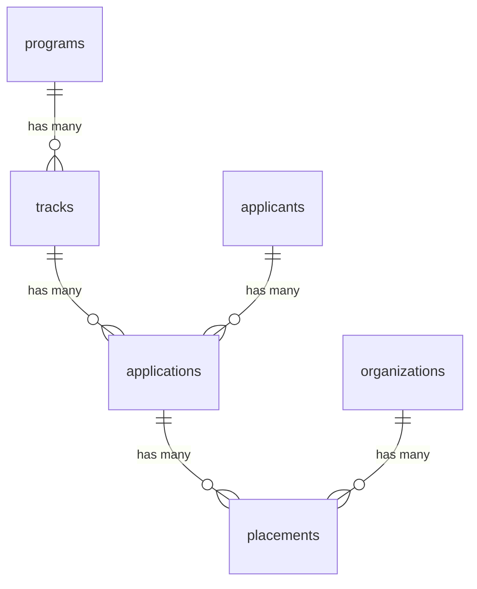

# Program Registration Schema

   

A reusable PostgreSQL data model — built with [Drizzle ORM](https://orm.drizzle.team/) — for
multi-track program registration systems: career accelerators, cohort programs,
internship pipelines, hackathon/datathon signups, and similar.

This started as the schema behind a real registration platform I built for a
multi-track career program (job shadowing + professional training tracks,
company placements, and an applicant review pipeline). This repo is a
generalized, sanitized version of that design — no real data, no
organization-specific logic — so it can be reused or reviewed as a
standalone example.

## Why this schema shape

- **`programs` are separate from `tracks`.** A program (e.g. "Cohort 4") can
  run several tracks in parallel with different eligibility rules and
  capacities (e.g. students vs. recent graduates). Splitting these avoids
  duplicating program metadata per track and lets a program scale to N
  tracks without a schema change.
- **`applicants` are program-agnostic.** A candidate is stored once and can
  apply across multiple programs/tracks over time (e.g. re-applying next
  cohort). Applicant identity and application history are kept separate on
  purpose — one `applicants` row, many `applications` rows.
- **`applications` carry the pipeline state**, not `applicants` directly.
  Status (`submitted → under_review → shortlisted → accepted/rejected`)
  belongs to a specific application to a specific track, not to the person.
- **`placements` are split out from `applications`.** An accepted
  application doesn't always map 1:1 to a final placement — a company can
  withdraw capacity and a candidate can be re-matched. Keeping placement as
  its own table with its own status (`proposed → confirmed → completed`)
  avoids overloading the application row with placement-specific fields.
- **Unique constraints do real work.** `applications` has a composite unique
  index on `(applicant_id, track_id)` so duplicate submissions are rejected
  at the database level, not just in application code.

## Entity overview



| Table | Purpose |
|---|---|
| `programs` | Top-level container (a cohort or season) |
| `tracks` | A path within a program (e.g. Job Shadowing, Professional Training) |
| `applicants` | Candidate identity, reusable across programs |
| `applications` | One applicant's submission to one track, with pipeline status |
| `organizations` | Partner companies that can host placements |
| `placements` | An accepted application matched to a hosting organization |

## Stack

- **Drizzle ORM** + **drizzle-kit** for schema definition and migrations
- **PostgreSQL** (tested against AWS RDS, works with any Postgres provider)
- **TypeScript** throughout

## Getting started

```bash
npm install
cp .env.example .env   # set DATABASE_URL to your Postgres instance
```

1. Create an empty database on your Postgres provider (console, `psql`, or
   pgAdmin — pgAdmin is great for *inspecting* data but migrations should
   always go through drizzle-kit, not manual DDL, to keep schema and code in
   sync).
2. Generate SQL migrations from the schema:
   ```bash
   npm run generate
   ```
3. Apply them to your database:
   ```bash
   npm run migrate
   ```
4. (Optional) Load sample data:
   ```bash
   npm run seed
   ```
5. Browse the data visually:
   ```bash
   npm run studio
   ```

## Adapting this for your own program

The most common changes needed to reuse this for a different program:

- Add fields to `applicants` for whatever intake form you collect (e.g.
  university, GPA, portfolio links).
- Add a `custom_fields` JSONB column to `applications` if different tracks
  need different question sets without a schema migration per track.
- If placements need per-seat capacity tracking, add a `capacity` /
  `filled_count` pair on `organizations` or a join table with a check
  constraint.

## License

MIT
